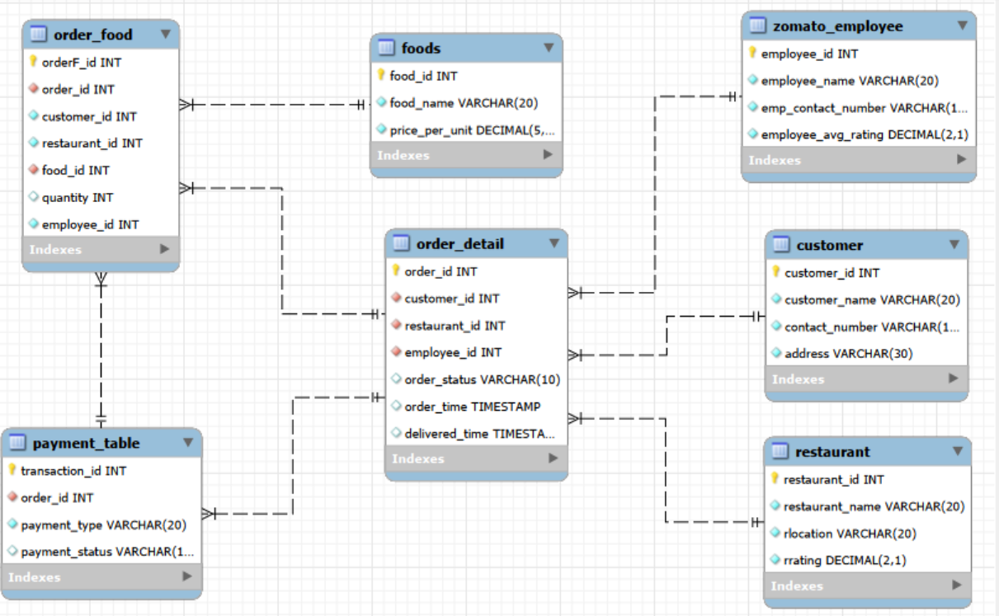

# 🍔 Zomato Database Management System


---

## 📌 Project Overview

Designed and developed a relational database for a Zomato-like food delivery platform using SQL. The project demonstrates database design, table relationships, normalization, and SQL operations to manage customers, restaurants, menu items, employees, and orders.

---

## 🎯 Project Objectives

- Design a normalized relational database
- Implement primary and foreign key relationships
- Maintain data integrity using constraints
- Manage customer, restaurant, and order data
- Practice SQL DDL and DML operations

---

## 🛠 Technologies Used

- SQL
- MySQL
- Relational Database Management System (RDBMS)

---

## 🗄 Database Tables

- Customers
- Restaurants
- Food Items
- Orders
- Employees
- Order Details

---

## 📚 SQL Concepts Covered

- CREATE TABLE
- INSERT INTO
- UPDATE
- DELETE
- ALTER TABLE
- PRIMARY KEY
- FOREIGN KEY
- Constraints
- Joins
- Data Modeling

---

## 📷 Database Preview


```markdown

```

---

## 📂 Folder Structure

```text
05-SQL-Zomato-Database
│
├── README.md
├── LICENSE
├── SQL
│   └── zomatodb project.sql
└── Images
```

---

## 💡 Key Learning Outcomes

- Designed a relational database from scratch.
- Established relationships between multiple entities.
- Applied normalization principles to reduce redundancy.
- Practiced writing SQL scripts for database creation and management.

---

## 👨‍💻 Author

**Shivam Choudhry**
